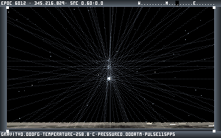

# Noctis IV in L.in.oleum

[](https://github.com/Fabulu/noctis-lino/actions/workflows/windows-release.yml)
[](https://github.com/Fabulu/noctis-lino/actions/workflows/macos-rosetta-nivgen.yml)
[](https://github.com/Fabulu/noctis-lino/actions/workflows/macos-aarch64-runtime.yml)

A complete playable port of [Noctis IV](https://en.wikipedia.org/wiki/Noctis_(video_game))
to **L.in.oleum**, the cross-platform assembly language its own author wrote.
Release packages target Windows x86, macOS x86_64, and native macOS arm64. Intel
Macs use the x86_64 app; Apple-Silicon Macs can use the native app or run the
x86_64 compatibility package through Rosetta 2.

Alessandro Ghignola wrote both. He built L.in.oleum specifically to write
Noctis V in it, then abandoned both projects. This repository finishes a
Noctis IV+ game in the language it inspired.

## At a glance

- Explore the procedural Feltyrion galaxy from the fully playable Stardrifter.
- Approach and land on every planet class, then walk, fly, save, and return.
- Keep the original 18.206-Hz simulation while desktop presentation defaults to
  smooth 60 Hz and browser presentation defaults to the authentic cadence.
- Run the production game in resizable Windows and native Cocoa hosts with music,
  screenshots, panoramas, checkpoints, and the original onboard systems.

## Play the game

The current Windows build covers the complete playable Noctis IV+ route. Walk
through the Stardrifter, target generated systems, approach and land on
planets, explore weather and terrain, return in the capsule, and save the
journey. The practical 2x window retains Noctis's authentic 320x200 software
framebuffer and resizes without changing simulation or rendering coordinates.

From PowerShell in the repository root, run:

```powershell
powershell -NoProfile -ExecutionPolicy Bypass -File .\play_noctis.ps1
```

Landing coordinates use the generated globe's local albedo, atmosphere,
weather, and scenario data, so different sites on the same world are visibly
distinct.

The launcher keeps the working directory fixed so the GUI assets, soundtrack,
starmap, and `work\CURRENT.LIN` checkpoint are found consistently. It builds
the game automatically when the executable is absent; pass `-Build` to force a
fresh production build. Clean saves also retain the current validated window
dimensions, so a resized game reopens at the same size.

### macOS packages

Download `Noctis-IV-macos-arm64.zip` for an Apple-Silicon Mac or
`Noctis-IV-macos-x86_64.zip` for an Intel Mac from the
[GitHub releases page](https://github.com/Fabulu/noctis-lino/releases). Verify it
with the adjacent `.sha256` file, extract it, and drag `Noctis IV.app` to
Applications. The native arm64 app targets macOS 11.0 or newer. The x86_64 app
targets macOS 10.15 or newer and can also run through Rosetta 2 on Apple Silicon.

Both apps are ad-hoc signed rather than Developer ID signed or notarized.
If macOS blocks its first launch, select Noctis IV under System Settings,
Privacy & Security, and choose Open Anyway; Control-click and Open is the
corresponding path on some older systems. Do not run the nested
`Noctis-IV.game` directly.

The Finder launcher verifies and installs data under
`~/Library/Application Support/Noctis IV`. It repairs missing or changed
immutable assets without replacing regular player-owned `STARMAP.BIN` or
`GUIDE.BIN`. Closing the window or choosing Quit follows the game's normal
Escape/save path, including leaving fullscreen or dismissing a modal first.
Back up `CURRENT.LIN`, `STARMAP.BIN`, and `GUIDE.BIN` to preserve a journey and
its catalogue additions.

### Essential controls

- F10 opens the GAME menu. W/A/S/D move, right-drag or the arrow keys look,
  and held left-click walks forward on a surface.
- E starts the Stardrifter roof lift. Walk into the roof cupola opening for the
  automatic return.
- Face the first right-wall computer and press Enter to use GOES. G opens its
  larger accessible view. At the third wall panel, Enter begins approach and
  opens the landing-site selector after FCS reports STANDBY.
- R and 5 open the world-space onboard-device and flight-control pages. Aim at
  a framed command and left-click it. Keys 6-9 remain direct command shortcuts.
- F1 opens About, F2 opens visual effects, F5 toggles smooth 60 FPS
  presentation, F6/F7 save and load, F8 toggles music, F9 shows the full
  control card, and Esc saves and quits. The iGUI full-screen title-bar button
  toggles full-screen mode; while full-screen, Esc returns to the window first.

Desktop builds default to smooth 60-Hz presentation. F5 selects the authentic
18.206-Hz presentation instead; either mode retains the original simulation
rate.

The complete browser build is live at
[linoctis.pages.dev](https://linoctis.pages.dev/), backed by the separate
[`Fabulu/linojava`](https://github.com/Fabulu/linojava) runtime. It compiles and
runs the Lino project as pure JavaScript, with no WebAssembly backend. The real
Lino-rendered iGUI, menus, framebuffer, game code, persistence, and packaged
Noctis assets run in the page. Fresh browser sessions default to authentic
18.206-Hz presentation in both worker and main-thread routes. Experimental
60-Hz presentation requires `?presentation=60`; sustained 60 FPS and
browser/native performance parity are not claimed.

### Flight and surface play

In GOES, `NEXT` selects a nearby generated star. L remains the global approach
fallback. During landing, use the arrows to choose coordinates and L or Enter
to descend.

- On a surface, J jumps, Space runs the jetpack, C cancels it, and W/A/S/D
  steer while thrust is active. L adds the original downward impulse.
- Digits 1-9 select surface cruise speed and 0 stops it. Ctrl + W/A/S/D stalks
  birds. Page Up and Page Down open and close the visor.
- Walk outside the capsule's 1,600-unit radius and re-enter it to start the
  original automatic return. R is the accessible fallback while inside.
- `+` and `-` adjust HUD brightness. X clears onboard pages.

Surface movement retains the source momentum, friction, slope resistance,
tiredness, terrain-dependent pace, and circular exploration limits. Capsule
return keeps the original 32-frame seal and 250-frame ascent timing.

### Saves, captures, and GOES

Checkpoints resume automatically. Each verified save maintains `CURRENT.BAK`,
and a damaged primary visibly recovers from that last-known-good copy. Enter
`NEW` in GOES to restart.

- M or `*` saves a numbered 320x200 BMP under `work\GALLERY`. B, or Delete on
  a surface, saves the raw pre-overlay image.
- On a settled surface, N or `/` saves the three-panel panorama. V or `.` saves
  its raw version.
- F3 opens the original moviemaker. Plus/minus changes its interval, Ctrl plus
  or minus changes decks, F changes the effect, Enter records, and P pauses.

GOES retains the original catalogue and Guide tools:

- `WHERE`, `SL`, `PAR`, `ST`, and `DL` locate or regenerate stars, planets, and
  moon trees.
- `CAT`, `PRI`, and `PRIF` read or export Guide records.
- `CAST`, `REP`, `DELE`, `CLEAN`, and `REPAIR` maintain player notes without
  altering protected shipped records.
- `OUTBOX` exports player additions. `INBOX` validates and merges another
  player's packet.
- `HELP` lists the resident modules, `CLR` clears output, and `X <text>` uses
  the Xnice bridge files.

`IMPORTGD` is intentionally a no-op because this port already uses the older
84-byte `GUIDE.BIN` format.

The GAME menu mirrors Flight control, Onboard devices, and Preferences in
resize-aware mouse-accessible pages over the live Stardrifter.

### Packages and releases

Build a clean, self-contained Windows play folder with every runtime asset and a
SHA-256 manifest:

```powershell
powershell -NoProfile -ExecutionPolicy Bypass -File .\package_noctis.ps1
```

The default output is `dist\Noctis-IV`. The command refuses to merge with an
existing directory, so stale files cannot masquerade as bundle content.

- Double-click `Play Noctis IV.cmd` inside the Windows bundle to play.
- The launcher anchors assets, checkpoints, catalogue files, and diagnostics to
  the bundle even when started from another working directory.
- All three desktop packages include the original 48,376-record `GUIDE.BIN`. Back
  up that file with saves and `STARMAP.BIN` to preserve player notes added through
  `CAST`.

Ordinary pushes and pull requests run protected-source, gameplay, source-build,
and package checks on hosted runners. A supported version tag matching `v*`
rebuilds the Windows x86, macOS x86_64, and native macOS arm64 executables from
the tagged source and publishes only after all three package graphs pass. Exact
semver tags such as `v1.0.0` create stable releases; historical beta tags remain
prereleases. Each release contains exactly nine assets: a ZIP, adjacent SHA-256
checksum, and source/compiler/binary provenance record for each platform. Each
extracted package contains its own per-file manifest. Both Windows package paths
run the launcher from an unrelated working directory on a private inactive
desktop and require a first frame, clean package-local save, and exit status zero.
The x86_64 macOS graph additionally proves all seven production NIVGEN hashes
under Rosetta. Both Mac graphs verify strict nested ad-hoc signatures before and
after extraction, launcher data behavior, the first Cocoa retrace, and a normal
save-and-quit path. See [CI_RELEASES.md](CI_RELEASES.md) for exact trust and
verification boundaries.

### Source platforms

Every shipping target compiles the same tracked `work/vhgame.txt` and
`work/vhnivgen.txt` dependency closure from `work/` and `main/lib`. Platform
selection changes only compiler CPU/SYS packs, generated executable format, and
the runtime/ABI implementation below that shared source boundary. Target-specific
Lino gameplay, renderer, floating-point, or library `.txt` overlays are forbidden.

- Windows x86 is a packaged and regularly played release target.
- macOS x86_64 is a packaged Cocoa target with resizing, logical pointer mapping,
  fullscreen, AudioToolbox output, and no XQuartz dependency. Intel Macs run it
  directly; Apple Silicon can use it through Rosetta 2.
- macOS arm64 is a separately packaged native Cocoa target for Apple Silicon,
  with the same game route, AudioQueue PCM, Finder-safe data launcher, and
  raw/extracted-package retrace, save, and quit gates. Both Mac apps are ad-hoc
  signed and not notarized.
- Linux remains the hosted compiler-bootstrap platform. Runtime sources under
  `src/linoleum_linux32` also retain directory enumeration through the supported
  qemu-user path.

## Screenshots

Every image below is captured from the production executable. Planet scenes use
fixed generated worlds, radius-scaled approaches, deterministic landing cells,
and measured camera poses so a camera inside the capsule cannot masquerade as a
rendering result. Reproduce them with
`tools\capture_noctis_scenes.ps1`.

| Stardrifter interior | Physical GOES console |
|---|---|
|  |  |

| Stellar corona | Close local planet |
|---|---|
|  |  |

| Internally hot | Craterized | Dense atmosphere | Felisian | Creased |
|---|---|---|---|---|
|  |  |  |  |  |

| Thin atmosphere | Large world | Frozen world | Milky world | Substellar object |
|---|---|---|---|---|
|  |  |  |  |  |


| Planetary console | Planetary surface |
|---|---|
|  |  |


| Lunar world | Dense-atmosphere world | Thin-atmosphere world |
|---|---|---|
|  |  |  |

| Rocky world | Frozen world | Quartz world |
|---|---|---|
|  |  |  |

| Close lunar sun | Dense-atmosphere sun | Thin-atmosphere flare |
|---|---|---|
|  |  |  |

| Distant airless sun | Class-1 frozen sun | Class-0 frozen flare |
|---|---|---|
|  |  |  |

| Habitable shoreline | NIV+-matched tree | Native hopper |
|---|---|---|
|  |  |  |

| Marked historical ruin edge | Complete Suricrasian Cube |
|---|---|
|  |  |

The repeated triangular silhouettes are the source renderer's marked ruin-edge
geometry, not a newly invented pyramid asset. The Cube is a maximum-height
25-by-25-cell megastructure; the elevated distant view keeps its complete
silhouette and the source's marked wall bands in frame.


## Project documentation

- [`HISTORY.md`](HISTORY.md) is the chronological development and release story,
  including the recent Stardrifter, lift, frame-rate, and checkpoint fixes.
- [`PLAYTEST.md`](PLAYTEST.md) is the detailed capability and verification log.
- [`PORTPLAN.md`](PORTPLAN.md) is the technical implementation and source-parity
  ledger; [`PORTPLAN-MACOS.md`](PORTPLAN-MACOS.md) records the completed x86_64
  host/package boundary, while `src/linoleum_macos_aarch64/README.md` documents
  the native Apple-Silicon runtime and package boundary.
- [`RELEASE_NOTES.md`](RELEASE_NOTES.md) describes the current desktop release and
  its known limitations.
- [`TEST_COVERAGE.md`](TEST_COVERAGE.md) states what automation and native play
  actually cover, including the representative procedural and native boundaries.
- [`CI_RELEASES.md`](CI_RELEASES.md) describes hosted source builds, package
  provenance, macOS validation, the optional interactive runner, and exact-nine-
  asset stable/prerelease publication.
- [`docs/NIVGEN.md`](docs/NIVGEN.md) documents the public NIVGEN protocol,
  local scoring workflow, known undefined texture tail, and accuracy strategy.

## Provenance

The base of this repository is an unmodified clone of
[8l/linoleum](https://github.com/8l/linoleum), commits `eb25dcb` and `9559333`.

No file inherited from upstream has been modified. Port code, tests, tools, and
documentation live in files added after `9559333`. This keeps the original
L.in.oleum sources intact under their WTOF Public License terms.

To inspect the complete added surface:

```
git diff 9559333..HEAD --stat
```

## What has been established

- The procedural galaxy hash is bit-exact against independent C and
  arbitrary-precision Python references across the tested sector corpus.
- Orbital planet appearance has byte-level NIV+ fixtures for all ten planet
  types. Landed rendering has targeted native page oracles for the polygon,
  sky, sphere, sun, flare, and object paths.
- The playable host retains Noctis's 18.206 Hz simulation while optionally
  presenting interpolated frames at 60 Hz.
- Exactness claims are scoped. [TEST_COVERAGE.md](TEST_COVERAGE.md) separates
  native evidence, independent references, playable smokes, and open gaps.

## Layout

| Path | What |
|---|---|
| `docs/`, `main/`, `examples/`, `src/` | upstream, untouched |
| `lino_build.ps1` | drives the compiler non-interactively |
| `work/` | port source, executable, assets, and probe programs |
| `tools/` | launch, capture, packaging, and release helpers |
| `noctis-harness/` | native fixtures and independent reference programs |
| `tests/` | focused and release regression checks |

## Building and testing

Build the production executable with:

```powershell
powershell -File lino_build.ps1 -Src work\vhgame.txt
```

The wrapper handles the historical GUI compiler, reports its warnings, verifies
the output artifact, and terminates the compiler after the build settles.

For interactive comparison against the local NIV+ reference build, run
`powershell -File tools\start_nivplus.ps1`. It uses a fast gameplay profile;
the byte-oracle capture rigs keep their separate pinned DOSBox-X settings.

Useful checks:

```powershell
python tests\test_vhgame.py       # lean integrated gameplay regression
python tests\run_all.py galaxy    # tests whose filename contains "galaxy"
python tests\run_all.py --deep    # full release and historical audit
```

Use the smallest relevant regression or playable smoke during ordinary work.
Run the complete roster before a release. Individual checks describe any GCC,
native-fixture, or external-reference requirements they have. The compiler
quirks uncovered during the port are recorded in
[`docs-notes/LINOBUGS.md`](docs-notes/LINOBUGS.md), not repeated here.

## Licence

Noctis IV and the Noctis-derived parts of this port are distributed under the
original WTOF Public License (WPL); the verbatim Noctis licence and credits are
in [`LICENSE.htm`](LICENSE.htm). The WPL permits free redistribution,
forbids charging for the covered work, and does not generally permit modified
versions without the copyright holder's express authorisation. Alessandro
Ghignola authorised this port to proceed on the condition that the original
gameplay is preserved; this repository is published on that basis.

The upstream L.in.oleum compiler has its own WPL notice in [`wpl.htm`](wpl.htm).
`src/linoleum_linux32/` is separately GPLv2 (Peterpaul Klein Haneveld). Those
notices remain scoped to their respective material; no single licence is
claimed for unrelated third-party components.

Noctis IV is Copyright (c) 1996-2002 Alessandro Ghignola. Portions of the manual
and soundtrack are Copyright (c) 2001-2002 Ryan J. Bury. See the licence files
before copying or redistributing the project or a packaged build.
