# Noctis IV in L.in.oleum

[](https://github.com/Fabulu/noctis-lino/actions/workflows/windows-release.yml)

A complete playable Windows port of [Noctis IV](https://en.wikipedia.org/wiki/Noctis_(video_game))
to **L.in.oleum**, the cross-platform assembly language its own author wrote.

Alessandro Ghignola wrote both. He built L.in.oleum specifically to write
Noctis V in it, then abandoned both projects. This repository finishes a
Noctis IV+ game in the language it inspired.

## At a glance

- Explore the procedural Feltyrion galaxy from the fully playable Stardrifter.
- Approach and land on every planet class, then walk, fly, save, and return.
- Choose the authentic 18.2 FPS presentation or smooth 60 FPS rendering without
  changing the original simulation rate.
- Run the production game in a resizable Windows host with music, screenshots,
  panoramas, checkpoints, and the original onboard systems.

## Play the game

The current Windows build covers the complete playable Noctis IV+ route. Walk
through the Stardrifter, target generated systems, approach and land on
planets, explore weather and terrain, return in the capsule, and save the
journey. The practical 2x window retains Noctis's authentic 320x200 software
framebuffer and resizes without changing simulation or rendering coordinates.

From PowerShell in the repository root, run:

```powershell
powershell -NoProfile -ExecutionPolicy Bypass -File .\play_noctis.ps1
```

Landing coordinates use the generated globe's local albedo, atmosphere,
weather, and scenario data, so different sites on the same world are visibly
distinct.

The launcher keeps the working directory fixed so the GUI assets, soundtrack,
starmap, and `work\CURRENT.LIN` checkpoint are found consistently. It builds
the game automatically when the executable is absent; pass `-Build` to force a
fresh production build. Clean saves also retain the current validated window
dimensions, so a resized game reopens at the same size.

### Essential controls

- F10 opens the GAME menu. W/A/S/D move, right-drag or the arrow keys look,
  and held left-click walks forward on a surface.
- E starts the Stardrifter roof lift. Walk into the roof cupola opening for the
  automatic return.
- Face the first right-wall computer and press Enter to use GOES. G opens its
  larger accessible view. At the third wall panel, Enter begins approach and
  opens the landing-site selector after FCS reports STANDBY.
- R and 5 open the world-space onboard-device and flight-control pages. Aim at
  a framed command and left-click it. Keys 6-9 remain direct command shortcuts.
- F1 opens About, F2 opens visual effects, F5 toggles smooth 60 FPS
  presentation, F6/F7 save and load, F8 toggles music, F9 shows the full
  control card, and Esc saves and quits.

The original 18.2 FPS presentation remains the default. The 60 FPS mode
interpolates player movement, flight, the lift, capsule, wildlife, ocean, and
close-star poses without changing the original simulation rate.

### Flight and surface play

In GOES, `NEXT` selects a nearby generated star. L remains the global approach
fallback. During landing, use the arrows to choose coordinates and L or Enter
to descend.

- On a surface, J jumps, Space runs the jetpack, C cancels it, and W/A/S/D
  steer while thrust is active. L adds the original downward impulse.
- Digits 1-9 select surface cruise speed and 0 stops it. Ctrl + W/A/S/D stalks
  birds. Page Up and Page Down open and close the visor.
- Walk outside the capsule's 1,600-unit radius and re-enter it to start the
  original automatic return. R is the accessible fallback while inside.
- `+` and `-` adjust HUD brightness. X clears onboard pages.

Surface movement retains the source momentum, friction, slope resistance,
tiredness, terrain-dependent pace, and circular exploration limits. Capsule
return keeps the original 32-frame seal and 250-frame ascent timing.

### Saves, captures, and GOES

Checkpoints resume automatically. Each verified save maintains `CURRENT.BAK`,
and a damaged primary visibly recovers from that last-known-good copy. Enter
`NEW` in GOES to restart.

- M or `*` saves a numbered 320x200 BMP under `work\GALLERY`. B, or Delete on
  a surface, saves the raw pre-overlay image.
- On a settled surface, N or `/` saves the three-panel panorama. V or `.` saves
  its raw version.
- F3 opens the original moviemaker. Plus/minus changes its interval, Ctrl plus
  or minus changes decks, F changes the effect, Enter records, and P pauses.

GOES retains the original catalogue and Guide tools:

- `WHERE`, `SL`, `PAR`, `ST`, and `DL` locate or regenerate stars, planets, and
  moon trees.
- `CAT`, `PRI`, and `PRIF` read or export Guide records.
- `CAST`, `REP`, `DELE`, `CLEAN`, and `REPAIR` maintain player notes without
  altering protected shipped records.
- `OUTBOX` exports player additions. `INBOX` validates and merges another
  player's packet.
- `HELP` lists the resident modules, `CLR` clears output, and `X <text>` uses
  the Xnice bridge files.

`IMPORTGD` is intentionally a no-op because this port already uses the older
84-byte `GUIDE.BIN` format.

The GAME menu mirrors Flight control, Onboard devices, and Preferences in
resize-aware mouse-accessible pages over the live Stardrifter.

### Portable package and releases

Build a clean, self-contained play folder with every runtime asset and a
SHA-256 manifest:

```powershell
powershell -NoProfile -ExecutionPolicy Bypass -File .\package_noctis.ps1
```

The default output is `dist\Noctis-IV`. The command refuses to merge with an
existing directory, so stale files cannot masquerade as bundle content.

- Double-click `Play Noctis IV.cmd` inside the bundle to play.
- The launcher anchors assets, checkpoints, catalogue files, and diagnostics to
  the bundle even when started from another working directory.
- The bundle includes the original 48,376-record `GUIDE.BIN`. Back up that file
  with saves and `STARMAP.BIN` to preserve player notes added through `CAST`.

Ordinary pushes and pull requests run the protected-source check, integrated
game regression, and snapshot package assembly on GitHub-hosted Windows. A
version tag matching `v*` runs the same focused regression, compiles the exact
tagged source on an isolated interactive `lino-gui` runner, verifies the fresh
i386 executable, and hands the standalone ZIP to a GitHub-hosted publication
job. The resulting prerelease includes its checksum and source/compiler/binary
provenance record. A separate manual workflow provides the same source-build
path without publishing. See [CI_RELEASES.md](CI_RELEASES.md) for the runner
setup and exact release boundaries.

## Screenshots

Every image below is captured from the production executable. Planet scenes use
fixed generated worlds, radius-scaled approaches, deterministic landing cells,
and measured camera poses so a camera inside the capsule cannot masquerade as a
rendering result. Reproduce them with
`tools\capture_noctis_scenes.ps1`.

| Stardrifter interior | Physical GOES console |
|---|---|
| 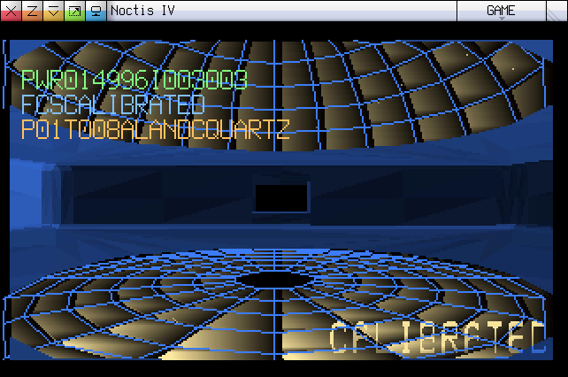 | 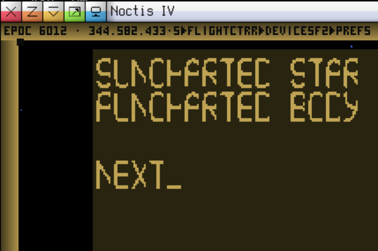 |

| Stellar corona | Close local planet |
|---|---|
| 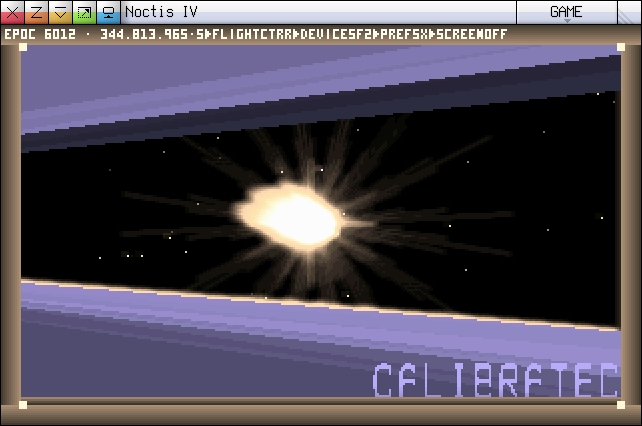 | 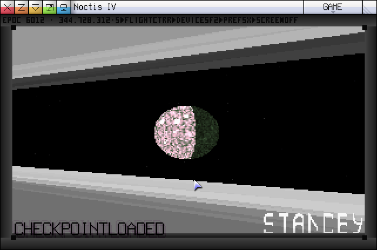 |

| Internally hot | Craterized | Dense atmosphere | Felisian | Creased |
|---|---|---|---|---|
| 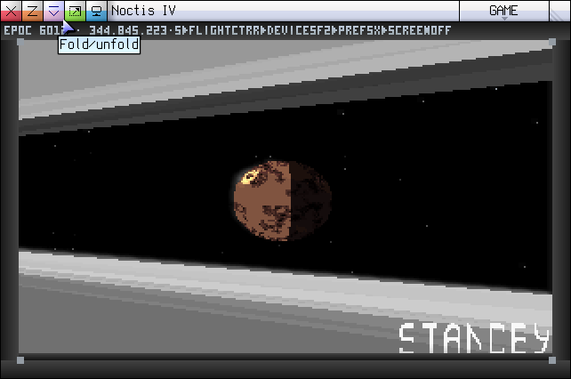 | 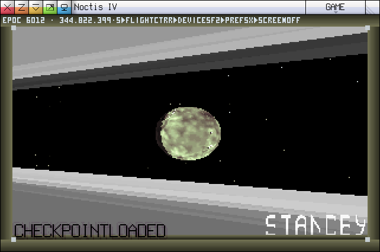 | 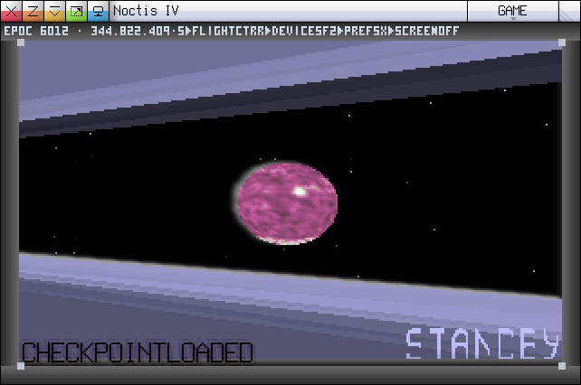 | 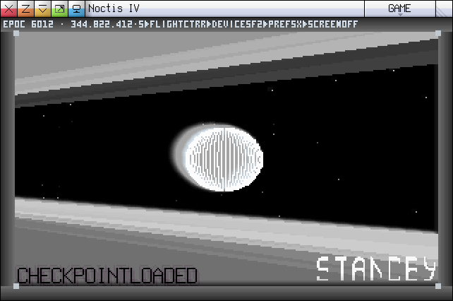 | 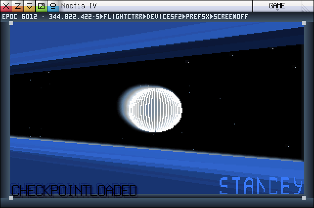 |

| Thin atmosphere | Large world | Frozen world | Milky world | Substellar object |
|---|---|---|---|---|
| 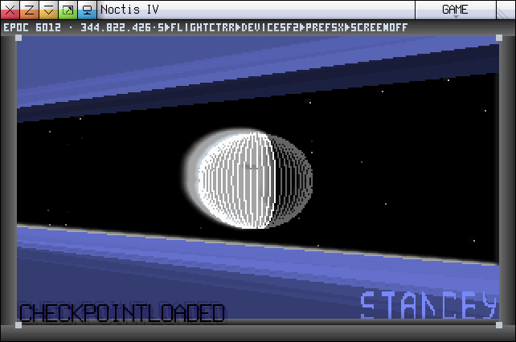 | 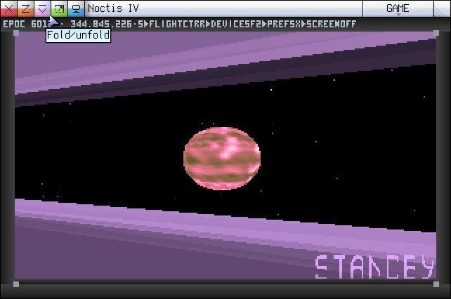 | 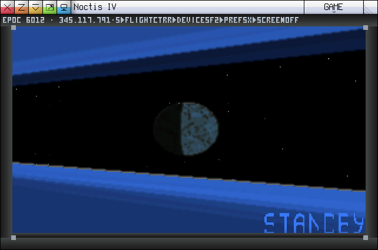 | 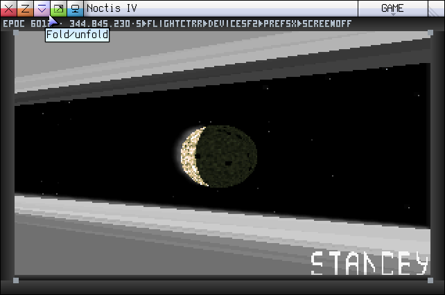 | 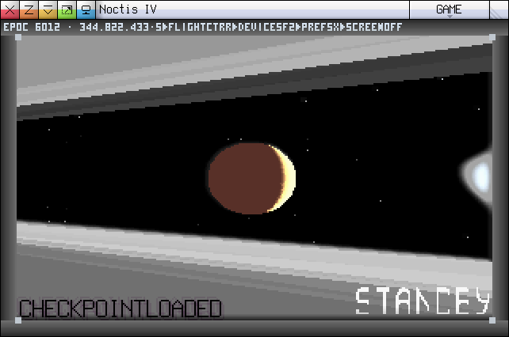 |

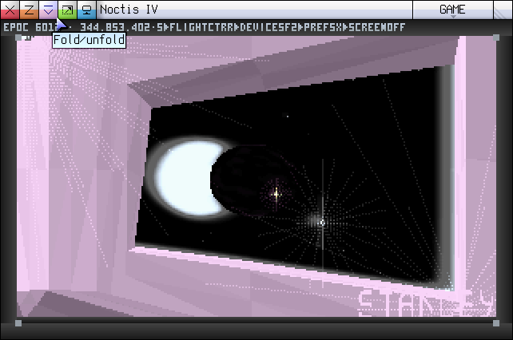

| Planetary console | Planetary surface |
|---|---|
| 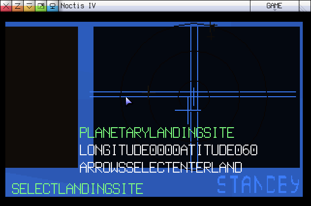 | 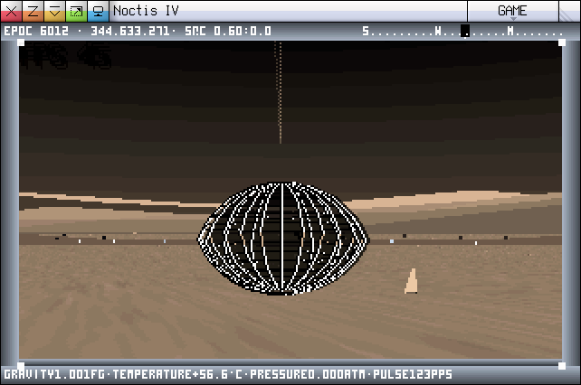 |

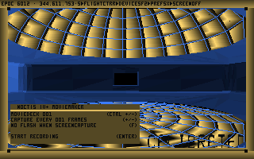

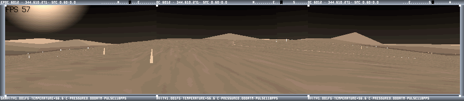

| Lunar world | Dense-atmosphere world | Thin-atmosphere world |
|---|---|---|
| 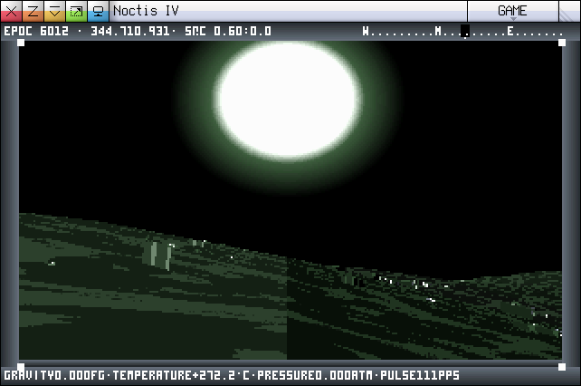 | 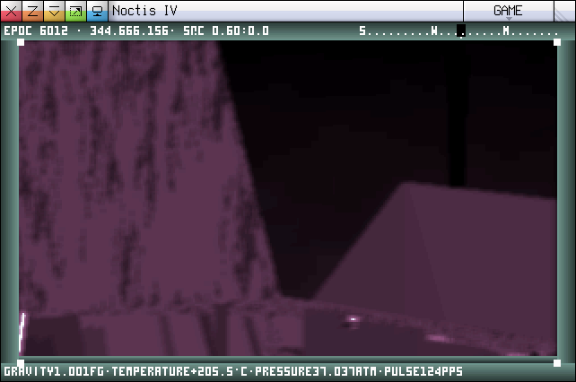 | 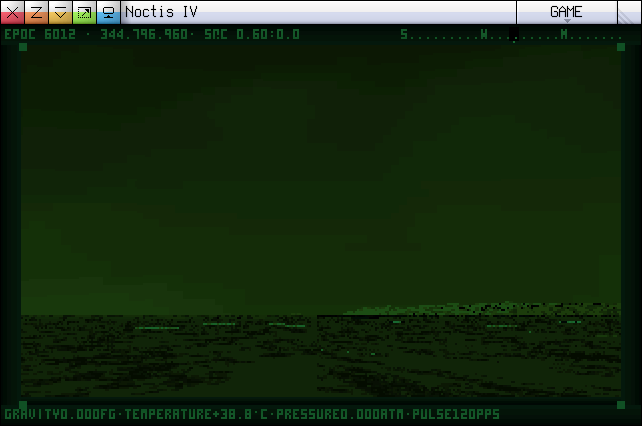 |

| Rocky world | Frozen world | Quartz world |
|---|---|---|
| 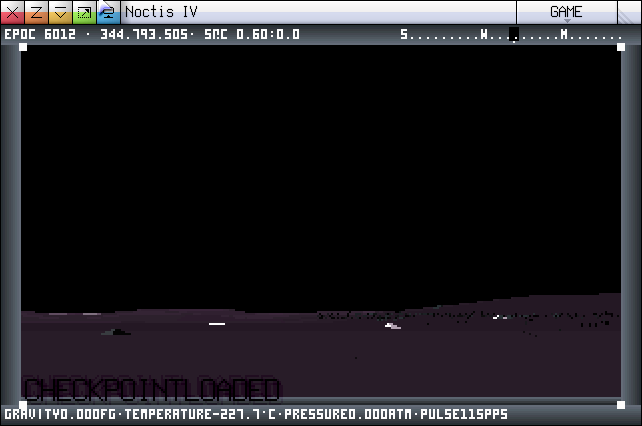 | 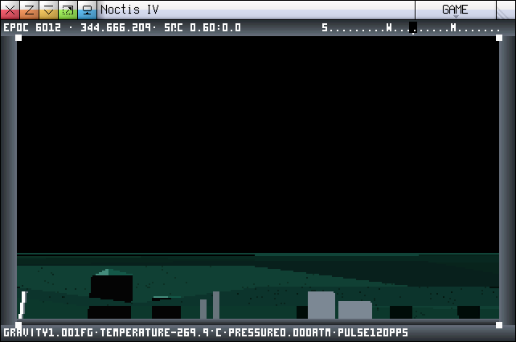 | 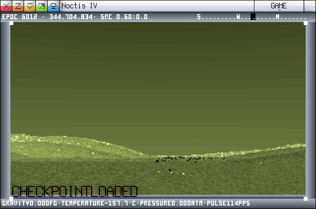 |

| Close lunar sun | Dense-atmosphere sun | Thin-atmosphere flare | Distant airless sun | Class-1 frozen sun |
|---|---|---|---|---|
| 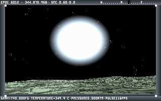 | 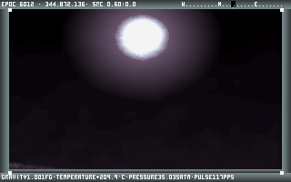 | 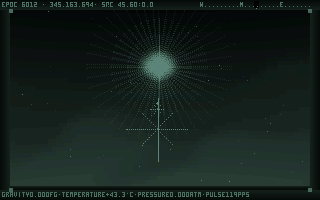 | 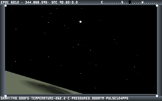 | 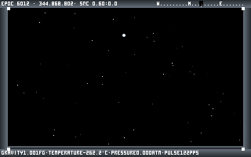 |

| Habitable shoreline | NIV+-matched tree | Native hopper |
|---|---|---|
| 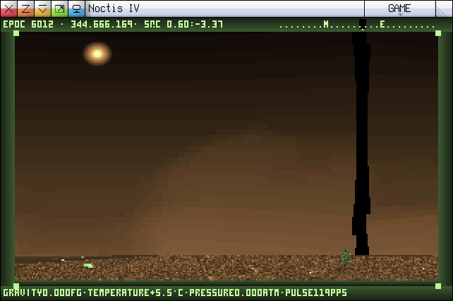 | 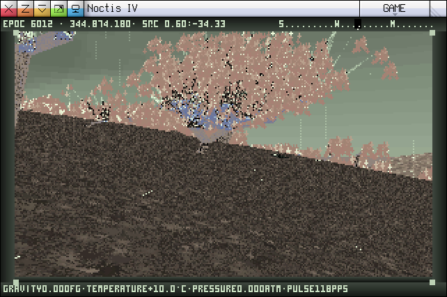 | 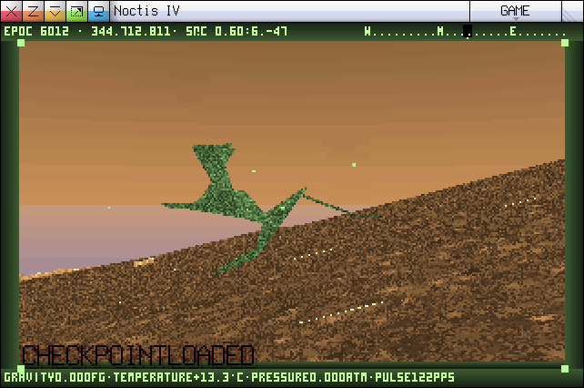 |

| Marked historical ruin edge | Complete Suricrasian Cube |
|---|---|
| 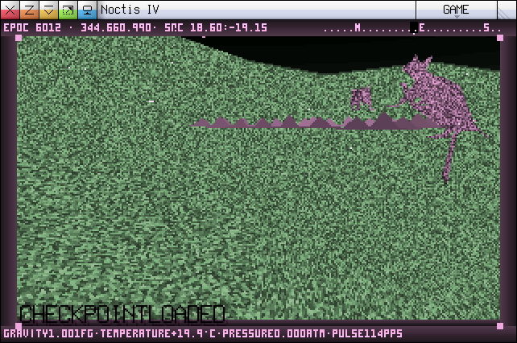 | 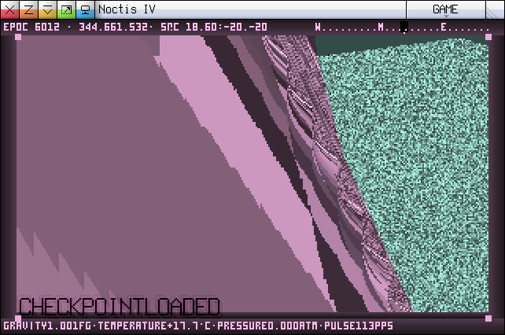 |

The repeated triangular silhouettes are the source renderer's marked ruin-edge
geometry, not a newly invented pyramid asset. The Cube is a maximum-height
25-by-25-cell megastructure; the elevated distant view keeps its complete
silhouette and the source's marked wall bands in frame.

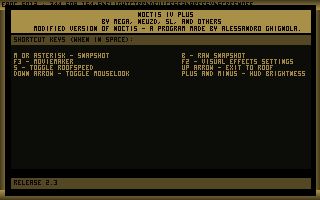

## Project documentation

- [`HISTORY.md`](HISTORY.md) is the chronological development and release story,
  including the recent Stardrifter, lift, frame-rate, and checkpoint fixes.
- [`PLAYTEST.md`](PLAYTEST.md) is the detailed capability and verification log.
- [`PORTPLAN.md`](PORTPLAN.md) is the technical implementation and source-parity
  ledger.
- [`RELEASE_NOTES.md`](RELEASE_NOTES.md) describes the current Windows release and
  its known limitations.
- [`TEST_COVERAGE.md`](TEST_COVERAGE.md) states what automation and native play
  actually cover, including the representative procedural and native boundaries.
- [`CI_RELEASES.md`](CI_RELEASES.md) describes hosted checks, the interactive
  source-build runner, and tagged prerelease publication.
- [`docs/NIVGEN.md`](docs/NIVGEN.md) documents the public NIVGEN protocol,
  local scoring workflow, known undefined texture tail, and accuracy strategy.

## Provenance

The base of this repository is an unmodified clone of
[8l/linoleum](https://github.com/8l/linoleum), commits `eb25dcb` and `9559333`.

**No upstream file has been modified.** Every commit after `9559333` only *adds*
files. This is deliberate: `main/lib/gen/compiler.txt` is licensed under the WTOF
Public License, which permits consulting, keeping and freely redistributing the
source but forbids changing it, for personal use as well as redistribution,
without the author's authorisation. To see exactly what is ours:

```
git diff 9559333..HEAD --stat
```

## What has been established

L.in.oleum can reproduce Noctis IV's galaxy, bit for bit.

The Feltyrion galaxy has no star table. Every one of its ~78 billion stars is a
pure hash of its sector's integer coordinates. The universe *is* that function.
`work/galaxy.txt` ports it, and its output is byte-identical to both a C
reference extracted from `noctis-iv-lr` and an independent arbitrary-precision
Python implementation, across 343 sectors spanning the galactic origin.

Two details turned out to be load-bearing:

- **The multiply must be signed.** Sector coordinates go negative either side of
  the centre; an unsigned product yields a different high word and therefore a
  different galaxy, one that generates perfectly happily and matches nothing.
  The fragment is `IMUL` (`F7 EB`), not `MUL` (`F7 E3`).
- **L.in.oleum has no 64-bit multiply.** The original folds `edx:eax` back
  together (`edx += eax`) after an `imul`, and the language exposes only the low
  32 bits. Both routes are implemented and verified against each other:
  `work/mulcheck.txt` (portable, four 16-by-16 partial products) and
  `work/mulcheck2.txt` (a two-byte inline machine-language fragment). They
  produce byte-identical output.

## Layout

| Path | What |
|---|---|
| `docs/`, `main/`, `examples/`, `src/` | upstream, untouched |
| `lino_build.ps1` | drives the compiler non-interactively |
| `work/*.txt` | our L.in.oleum programs |
| `verify_mul.py` | checks the 64-bit multiply against exact arithmetic |
| `noctis-harness/` | C and Python reference implementations + three-way diff |
| `tests/` | regression suite for the galaxy hash and the `*%` instruction |

## Building and testing

The compiler is a GUI-subsystem binary: it never writes to stdout and it lingers
on screen until dismissed. `lino_build.ps1` works around this by detecting the
artifacts it leaves behind and killing it as soon as they appear.

```powershell
powershell -File lino_build.ps1 -Src work\vhgame.txt
```

Success prints `OK <path> <bytes> <seconds>`; warnings are listed but do not
fail the build; `error:` in `errorlog.txt` does.

To reproduce the galaxy-hash result you also need the reference implementations:

```powershell
git clone https://github.com/dgcole/noctis-iv-lr        # de-assembled C++ reference
git clone https://github.com/jorisvddonk/Noctis-IV-Plus # the maintained DOS original

cd noctis-harness
gcc -O2 -o oracle.exe oracle.c && ./oracle.exe   # C ground truth
python oracle.py                                 # independent Python, cross-checks C
# run work/galaxy.exe, copy galaxy.bin here as lino.bin
python compare3.py
```

Those two repositories are deliberately **not** vendored here. They are separate
upstream projects with their own licensing.

### Regression suite

```powershell
python tests\test_vhgame.py       # lean integrated gameplay regression
python tests\run_all.py galaxy    # tests whose filename contains "galaxy"
python tests\run_all.py --deep    # full release and historical audit
```

Use the smallest relevant regression or playable smoke during ordinary work.
Run the complete 24-suite roster for a release or deliberate deep audit. Every
suite is independently runnable and explains its own prerequisites and scope.
Representative foundation checks include:

| Test | Guards |
|---|---|
| `test_toolchain.py` | the extended toolchain is installed, the two copies of `i386m.bin` agree, `main/` is pristine, and every wrong compiler/pack pairing refuses to build |
| `test_galaxy.py` | `work/galaxy2.txt` (the `*%` rewrite) is bit-exact with the `{ F7 EB }` version, a freshly compiled C oracle, and two bignum Python references, including signedness at the opcode level |
| `test_galaxy_stress.py` | the same arithmetic on coordinates the 343-sector sweep cannot reach, including the ones that make all three cutoff branches fire |
| `test_mulsplit.py` | the `*%` contract `galaxy2.txt` cannot self-test: which half lands in which operand, signed vs unsigned, and which registers survive |

- Arithmetic and generation tests rebuild their Lino, C, and Python subjects
  where those independent oracles exist.
- Native NIV+ fixtures protect renderer and generation boundaries that cannot
  be derived from the port itself.
- Several historical suites include deliberately wrong variants to prove their
  graders still discriminate.
- C-backed reference checks require `gcc` on `PATH`; individual tests report
  any additional reference-source requirement.

## Toolchain gotchas

Hard-won; all of these cost real debugging time.

- **`"variables"` vs `"workspace"` is not a style choice.** In `variables`,
  `name = N;` declares a variable initialised to N. In `workspace`,
  `name = N;` allocates an *uninitialised vector of N units* and the name is its
  **address**. So `foo = 0;` in `workspace` allocates nothing, top-of-workspace
  never advances, and every symbol silently collapses onto the same cell. No
  error and no warning, just uniformly wrong values.
- **Do not launch the compiler with PowerShell's `Start-Process`.** It appends a
  trailing space to the argument string, which the compiler folds into the output
  filename, giving `prog.txt .exe`. Use `ProcessStartInfo.Arguments`, which is
  passed verbatim.
- **No path may contain `--`.** See below.

## Bugs found in L.in.oleum

1. **Command-line parser truncates on `--` anywhere.** `copy option` ends a
   value at any two consecutive hyphens, including inside a filesystem path,
   with no check that an option name follows. A path containing `--` silently
   truncates and the build dies reporting `error reading cpu pack`, pointing at
   a component that is perfectly fine. `lino_build.ps1` refuses such paths rather
   than let you chase the phantom.
2. **`main/linux_compiler.bin` is dead on modern systems.** Segfaults at startup,
   before parsing arguments, in every configuration, including with no arguments
   at all.
3. **The relative-address modifier is documented backwards.** For `<+N label>` in
   machine-language fragments the manual gives `label - pc + N`; the compiler
   computes `label - pc - N`, and `+` and `-` behave identically (both subtract).
   The manual's own worked example proves the manual wrong.
4. **The application-name field is not cleared before writing.** The compiler
   writes `strlen+1` bytes over the 40-byte field in the runtime template, so a
   program named `mul64` ships with `mul64\0leum runtime` embedded, a shard of
   the template string `L.in.oleum runtime`.

Documentation drift worth knowing: `readme.htm` says the CPU pack holds 6616
instruction patterns; it holds **6241** (`48 * 6241 + 8` = the exact file size of
`main/cpu/i386.bin`, and the compiler enforces that equality). The manual also
calls the program counter `bcodesize`; it is `bpos`.

## Licence

Noctis IV and the Noctis-derived parts of this port are distributed under the
original WTOF Public License (WPL); the verbatim Noctis licence and credits are
in [`LICENSE.htm`](LICENSE.htm). The WPL permits free redistribution,
forbids charging for the covered work, and does not generally permit modified
versions without the copyright holder's express authorisation. Alessandro
Ghignola authorised this port to proceed on the condition that the original
gameplay is preserved; this repository is published on that basis.

The upstream L.in.oleum compiler has its own WPL notice in [`wpl.htm`](wpl.htm).
`src/linoleum_linux32/` is separately GPLv2 (Peterpaul Klein Haneveld). Those
notices remain scoped to their respective material; no single licence is
claimed for unrelated third-party components.

Noctis IV is Copyright (c) 1996-2002 Alessandro Ghignola. Portions of the manual
and soundtrack are Copyright (c) 2001-2002 Ryan J. Bury. See the licence files
before copying or redistributing the project or a packaged build.
